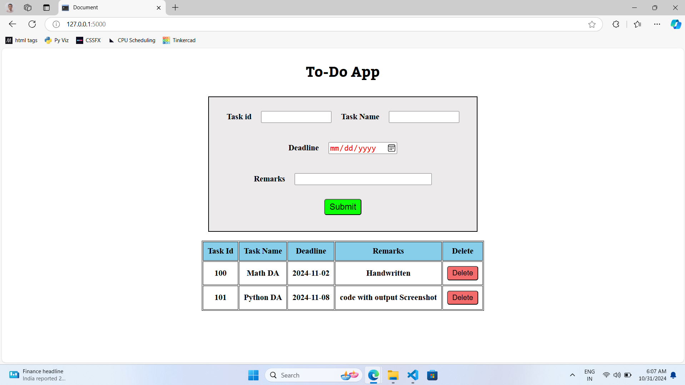

# To-Do App

A simple To-Do app built using **Python Flask**. This app allows users to create, view, update, and delete tasks from a to-do list. Users can also log in to manage their personal tasks. It uses a database to store and organize tasks for each user.

## Features

- **CRUD Operations**: Create, Read, Update, Delete tasks.
- **Responsive UI**: Easy-to-use interface for managing tasks.
- **Database Integration**: Persistent data storage for tasks.
- **Task Management**: Mark tasks as completed or pending.

## Tech Stack

- **Backend**: Python, Flask
- **Frontend**: HTML, CSS, JavaScript (Bootstrap for styling)
- **Database**: SQLite 
  
## Setup

1. **Clone the Repository**
   ```bash
   git clone https://github.com/yourusername/todo-app.git
   cd todo-app
   ```

2. **Install Dependencies**
   ```bash
   pip install Flask sqlite3
   ```

3. **Run the App**
   ```bash
   flask run
   ```
   The app will be available at `http://127.0.0.1:5000/`.

## Project Structure

```plaintext
├── Todo-App/
│   ├── app.py               # Main application file
│   ├── templates/
│   │   └── index.html       # HTML template for the app
│   └── static/
│       └── index.css        # CSS styling for the app
└── README.md                # Project documentation
```
## Screenshots



## Usage

- **Add a Task**: Click the "Add Task" button and fill out the form to add a new task.
- **View Tasks**: View all pending and completed tasks on the dashboard.
- **Delete Task**: Remove a task by clicking on the delete button.
  
## Contributing

Feel free to open issues and submit pull requests if you have any suggestions for improvement.

## License

This project is licensed under the MIT License. See the [LICENSE](LICENSE) file for details.
